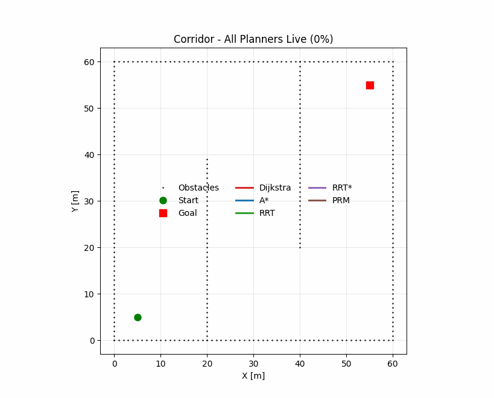
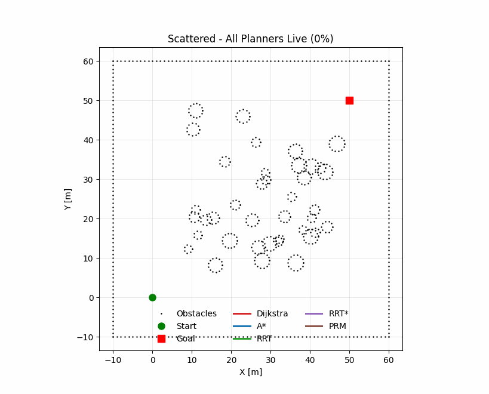
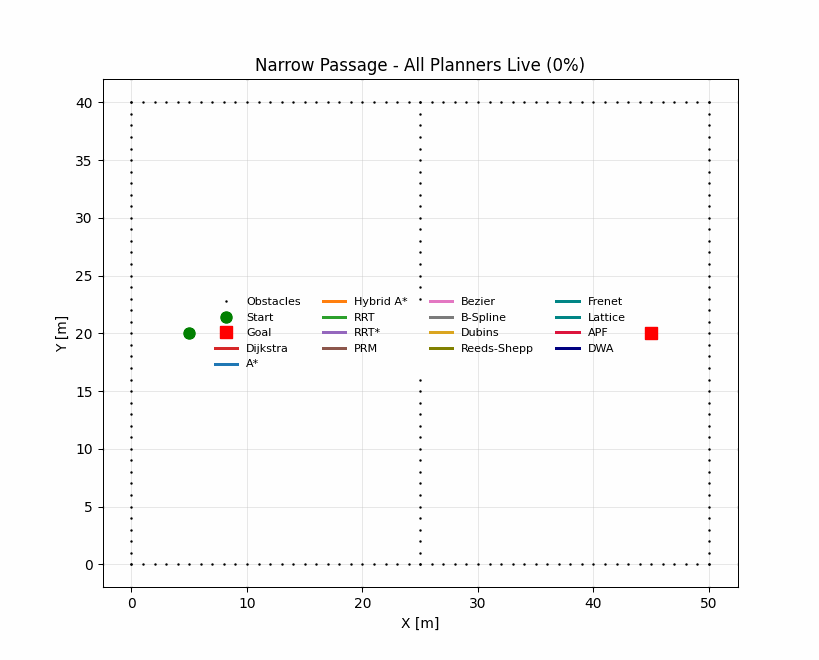
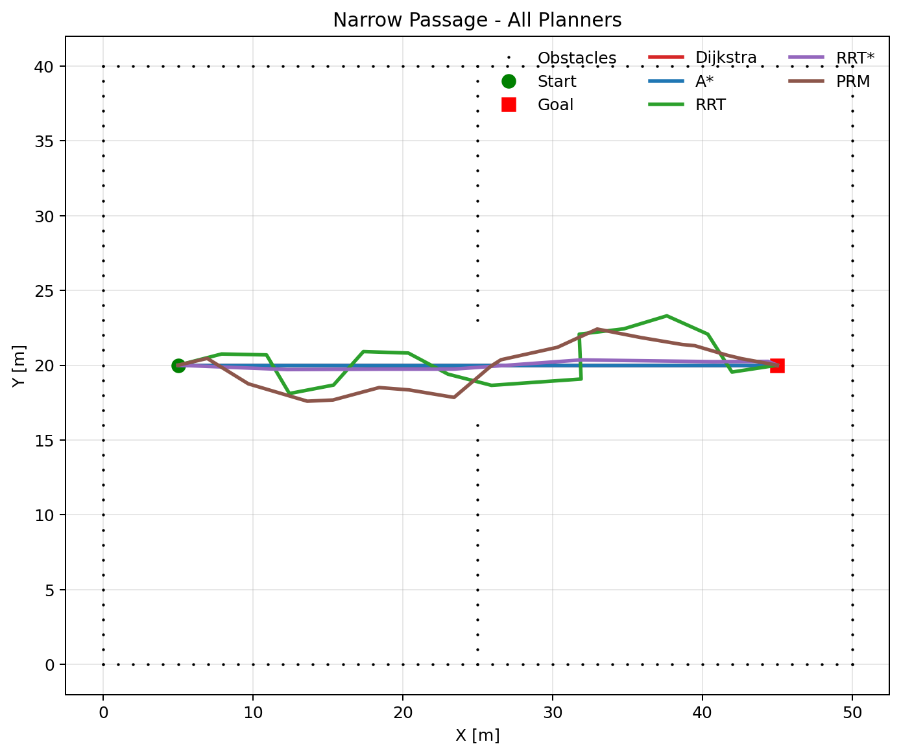
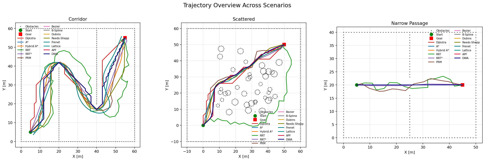
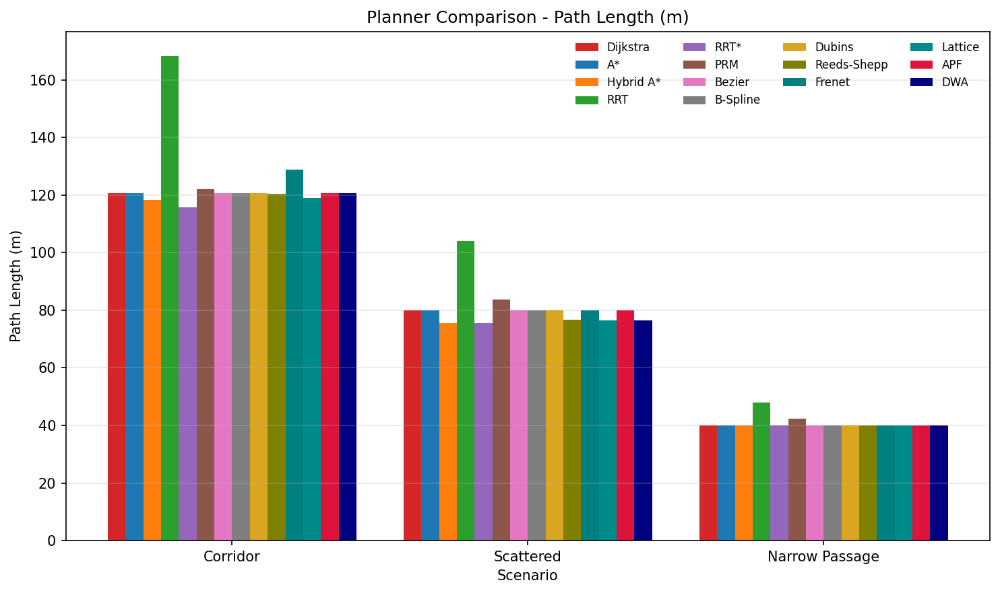
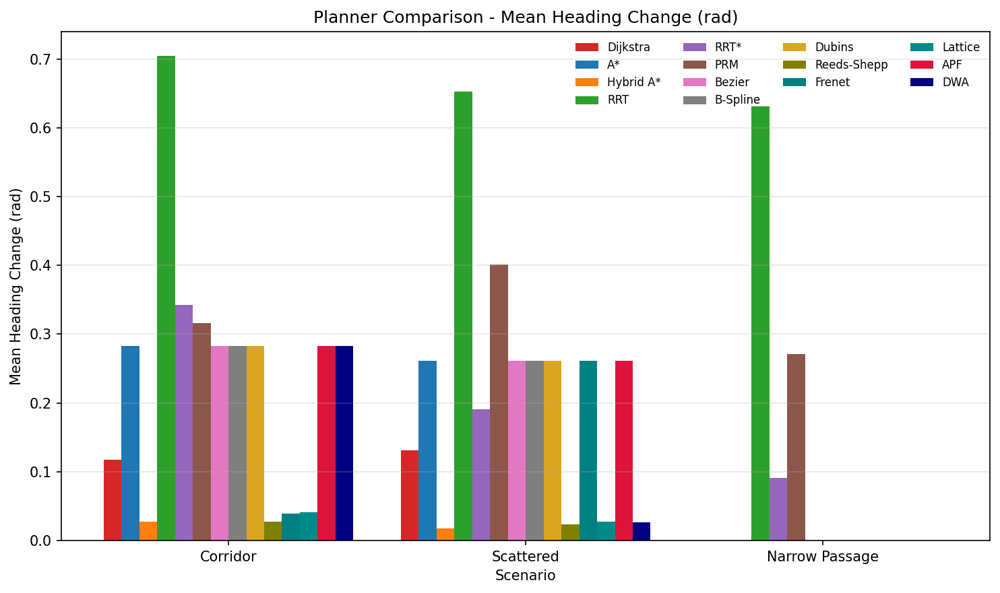
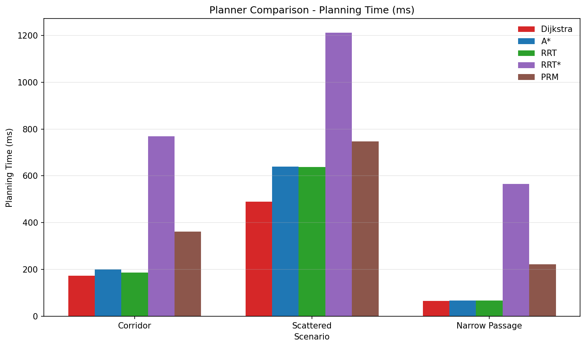
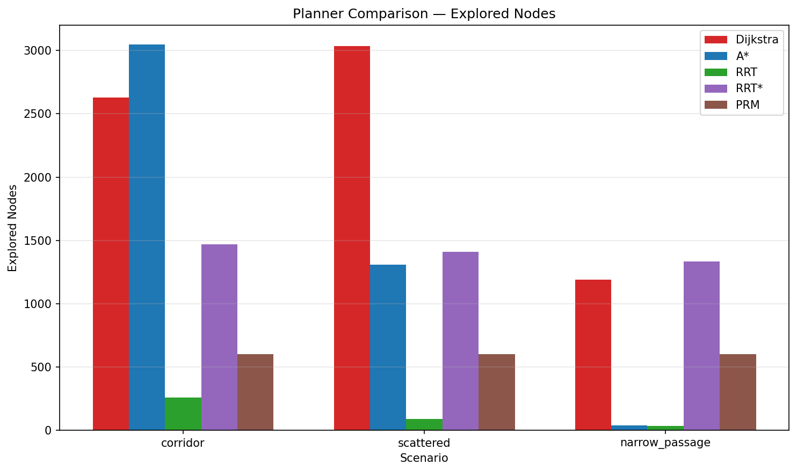

# Path Planning Algorithms Benchmark

Comparative benchmark and visualization project for representative path-planning methods in Python.

这是一个面向自动驾驶规划展示的路径规划 benchmark 项目。项目把搜索、采样、曲线、运动学/栅格、势场、局部规划几大类方法统一到同一套二维障碍地图评测框架里，支持：

- 多算法同图静态对比
- 每个场景的联跑 GIF 动图
- 统一结果表导出
- 路径长度、平滑性、规划时间、搜索规模四类指标评测

## At a Glance

- `14` 个已接入方法，覆盖 `6` 大类规划思路
- `3` 个典型场景：`Corridor / Scattered / Narrow Passage`
- 所有算法在同一张图中使用不同颜色叠加展示
- 每个场景均提供 GIF 动画，适合 GitHub 展示和面试讲解
- 统一输出到 `outputs_planning/`，README 展示素材固定放在 `assets/readme/`
- 仓库目录结构与 `path-tracking-controllers` 保持一致，便于成套展示

## Planning Methods Landscape

路径规划方法通常可以分为以下几类：

- `Search-based`
  - `Dijkstra`
  - `A*`
  - `Hybrid A*`
- `Sampling-based`
  - `RRT`
  - `RRT*`
  - `PRM`
- `Curve-based`
  - `Bezier`
  - `B-Spline`
  - `Dubins`
  - `Reeds-Shepp`
- `Optimization / trajectory generation`
  - `Frenet Optimal Trajectory`
  - `Lattice Planner`
- `Potential Field`
  - `APF`
- `Local Planning`
  - `DWA`

## Implemented in This Repo

| Category | Method | Role in This Benchmark |
| --- | --- | --- |
| Search-based | `Dijkstra` | 经典最短路径 baseline，保证图搜索最优解 |
| Search-based | `A*` | 启发式图搜索，兼顾最优性与效率 |
| Search-based | `Hybrid A*` | 带朝向约束的连续状态搜索 |
| Sampling-based | `RRT` | 快速求可行解 |
| Sampling-based | `RRT*` | 渐近最优采样规划 |
| Sampling-based | `PRM` | 路网式多查询采样规划 |
| Curve-based | `Bezier` | 基于导引路径的分段 Bezier 平滑 |
| Curve-based | `B-Spline` | 基于导引路径的 B-Spline 平滑 |
| Curve-based | `Dubins` | 最小转弯半径约束下的圆弧平滑 |
| Curve-based | `Reeds-Shepp` | 支持前进/倒车的曲率约束路径 |
| Trajectory generation | `Frenet` | Frenet 坐标系下的轨迹生成 |
| Kinematic / lattice-based | `Lattice` | 基于固定运动原语的状态栅格规划 |
| Potential Field | `APF` | 人工势场法 |
| Local Planning | `DWA` | 动态窗口局部规划 |

## Benchmark Fairness Note

这个项目里不同类别的方法承担的角色不完全相同，所以 README 里把评测设定说明清楚很重要：

- `Dijkstra / A* / Hybrid A* / RRT / RRT* / PRM / Lattice / Reeds-Shepp` 主要作为全局或运动学约束规划器直接在障碍地图上搜索。
- `Bezier / B-Spline / Dubins / Frenet / APF / DWA` 这类方法在二维占据栅格 benchmark 里更适合作为“导引路径平滑 / 轨迹生成 / 局部规划”代表，因此在需要参考路径时会使用 `A*` 生成 guide path，再做曲线生成或局部优化。
- 所有方法共享同一套二维占据地图、同一碰撞检测器、同一路径重采样规则和同一指标提取流程，避免因为后处理差异把算法本体差异掩盖掉。

这样做的目的是把不同家族的方法放进统一框架里展示“路径质量、平滑性、可行性和计算代价”的 trade-off，而不是假装它们在工程职责上完全等价。

## Design Choices / Engineering Notes

- `统一地图与碰撞模型`：所有算法都运行在同一批二维占据栅格场景上，并共享同一碰撞检测与越界判定逻辑。这样做可以把差异更多地归因到规划策略，而不是地图解析或碰撞模型口径不同。
- `场景选择`：`Corridor` 主要看绕行质量和长路径搜索能力，`Scattered` 主要看复杂障碍环境下的鲁棒性，`Narrow Passage` 主要看狭窄可行通道的发现能力。这三个场景组合起来，刚好能把搜索、采样、平滑和局部规划的典型短板拉出来。
- `指标选择`：`Path Length` 反映全局效率，`Mean Heading Change` 近似反映平滑性与可驾驶性，`Planning Time` 反映实时性成本，`Explored Nodes` 反映搜索规模与算法开销。这组指标的设计重点不是只看“有没有路”，而是看“路的质量值不值得工程落地”。
- `公平性处理`：不同规划家族在工程里扮演的职责并不完全等价，所以这里不强行把所有方法解释成同一层级的全局规划器。对于更适合作为平滑器、轨迹生成器或局部规划器的方法，README 会明确说明其 guide path 依赖，并在统一后处理下做横向比较。
- `可视化策略`：每个场景都用“所有算法同图、不同颜色”的方式展示，目的是让失败模式、拓扑差异和路径风格差异在 GitHub 首页上就能被直接看见，而不是只能藏在表格里。

## Scenarios

| Scenario | Description |
| --- | --- |
| `Corridor` | 长走廊 + 障碍封堵，考察绕行能力和长路径搜索质量 |
| `Scattered` | 随机散布障碍物，考察复杂环境中的路径质量与鲁棒性 |
| `Narrow Passage` | 中间仅有窄通道，考察狭窄可通行区域发现能力 |

## Visualization

### Corridor




### Scattered




### Narrow Passage





### Trajectory Overview



## Metric Dashboard

**Path Length**



**Mean Heading Change**



**Planning Time**



**Explored Nodes**



## Experiment Highlights

### 1. Search / Sampling Baselines

- `Dijkstra` 和 `A*` 仍然是最稳定的最短路径 baseline。
- `A*` 在 `Scattered` 场景只探索了 `840` 个节点，而 `Dijkstra` 为 `3035`，启发式优势比较明显。
- `RRT` 很快能给出可行路径，但路径通常更长、更锯齿。
- `RRT*` 在 `Corridor` 和 `Scattered` 场景中都给出了最短或接近最短的路径，符合其渐近最优特性。

### 2. Kinematic / Smoothness-oriented Methods

- `Hybrid A*` 在 `Corridor` 和 `Scattered` 场景下路径更短，同时平均航向变化显著更低：
  - `Corridor`: `0.027 rad`
  - `Scattered`: `0.018 rad`
- `Reeds-Shepp` 和 `Lattice` 的平滑性也非常好，说明显式运动学原语和带朝向状态搜索对“可驾驶性”很有帮助。
- `Frenet` 的平滑性较好，但在障碍密集场景里更依赖参考路径质量。

### 3. Curve-based / Local Methods

- `Bezier / B-Spline / Dubins` 在这个 benchmark 里更多体现为路径平滑和曲率约束表达能力。
- `APF` 和 `DWA` 已经接入统一流程，可以和全局规划器同场景联跑并输出结果图与 GIF。
- `DWA` 在 `Scattered` 场景下能得到较短且较平滑的路径，但时间代价高于纯图搜索。

## Failure Cases / Limitations

- `Dijkstra` 最稳，但在大地图或更高分辨率下探索量会迅速膨胀，不适合把实时性作为核心目标的场景。
- `A*` 的效率明显依赖启发式质量与栅格分辨率；在窄通道和密集障碍下，节点扩展量仍然可能显著上升。
- `Hybrid A*` 对步长、朝向离散粒度和运动原语设计敏感；离散过粗会丢可行解，过细又会带来明显的计算开销。
- `RRT / RRT*` 对随机种子、采样预算和扩展半径较敏感；`RRT` 更快但路径粗糙，`RRT*` 更优但通常需要更多时间才能体现优势。
- `PRM` 对 roadmap 密度和连接半径敏感，更适合多查询问题；在单次查询 benchmark 里不一定天然占优。
- `Bezier / B-Spline / Dubins / Reeds-Shepp / Frenet` 这类方法对 guide path 或参考轨迹质量比较依赖；当导引路径离障碍太近时，平滑结果可能牺牲安全裕度甚至可行性。
- `APF` 容易陷入局部极小值，`Narrow Passage` 这类场景天然对它不友好。
- `DWA` 作为局部规划器容易短视，没有强全局引导时可能在复杂拓扑里做出局部最优决策；障碍密集时计算量也会明显上升。
- `整体局限`：当前 benchmark 基于静态二维占据地图，没有动态障碍、不确定性传播、速度剖面优化和完整车辆动力学，因此更适合作为“规划家族对比项目”，而不是完整自动驾驶规划栈评测。

## Benchmark Results

完整结果会在本地运行后输出到 `outputs_planning/results.csv`。

当前版本的一些代表性结果：

- `Corridor`
  - Best path length: `RRT* = 115.83 m`
  - Best smoothness: `Hybrid A* = 0.027 rad`
- `Scattered`
  - Best path length: `RRT* = 75.49 m`
  - Best smoothness: `Hybrid A* = 0.018 rad`
- `Narrow Passage`
  - 多种方法都能找到近似最优通道解，`A* / Hybrid A* / Lattice / Reeds-Shepp / DWA` 都稳定通过

## Quick Start

### 1. Install

```bash
pip install -r requirements.txt
```

### 2. Run the benchmark

```bash
python Compare_planner.py
```

默认会重新生成：

- 场景对比图
- 结果表 `outputs_planning/results.csv`
- 指标汇总柱状图

### 3. Export GIFs

```bash
python Compare_planner.py --animate
```

会额外生成：

- `outputs_planning/animations/corridor_all_planners.gif`
- `outputs_planning/animations/scattered_all_planners.gif`
- `outputs_planning/animations/narrow_passage_all_planners.gif`

### 4. Interactive display

```bash
python Compare_planner.py --show
python Compare_planner.py --show-animation
```

## File Guide

| File | Purpose |
| --- | --- |
| `Compare_planner.py` | 规划 benchmark 薄入口，和控制器仓库的入口形式保持一致 |
| `benchmark_runner.py` | 统一调度算法、导出图表与 GIF 的核心运行器 |
| `common.py` | 公共地图、碰撞检测、路径指标和场景构造 |
| `guided_utils.py` | A* 导引路径构造与曲线/局部规划公共收尾逻辑 |
| `Dijkstra.py` | Dijkstra 全局搜索 |
| `Astar.py` | A* 全局搜索 |
| `HybridAstar.py` | 带朝向约束的 Hybrid A* |
| `RRT.py` | RRT 采样规划 |
| `RRT_Star.py` | RRT* 采样规划 |
| `PRM.py` | PRM 路网规划 |
| `Bezier.py` | Bezier 曲线平滑 |
| `BSpline.py` | B-Spline 曲线平滑 |
| `Dubins.py` | Dubins 风格曲率约束平滑 |
| `ReedsShepp.py` | 支持倒车的曲率约束规划 |
| `Frenet.py` | Frenet 轨迹生成 |
| `Lattice.py` | 状态栅格 / motion primitive 规划 |
| `APF.py` | 人工势场法 |
| `DWA.py` | 动态窗口局部规划 |
| `assets/readme/` | README 展示图片与 GIF |
| `outputs_planning/` | benchmark 本地运行输出目录，默认不纳入 GitHub 展示结构 |
