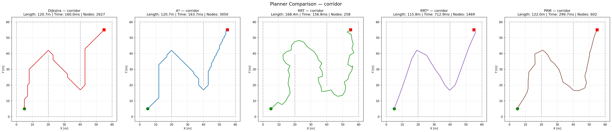
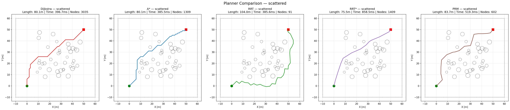

# Path Planning Algorithms Benchmark

Comparative benchmark and visualization for classical path-planning algorithms in Python.

这是一个面向自动驾驶规划算法岗位展示的路径规划 benchmark 项目。统一实现并对比 5 种经典规划算法，在 3 个不同障碍物场景上进行量化评测，支持一键出图出表。

## At a Glance

- `5` 类规划器：`Dijkstra / A* / RRT / RRT* / PRM`
- `3` 类测试场景：`Corridor / Scattered / Narrow Passage`
- 统一栅格地图、统一障碍物碰撞检测、统一评测指标
- 自动生成对比图表和 CSV 结果
- 依赖简洁，仅需 `numpy + matplotlib`
- 适合作为自动驾驶规划岗位的项目展示与面试讲解材料

---

## Visualization

### Scenario Comparison

**Corridor — 迷宫式走廊**



**Scattered — 随机散布障碍物**



**Narrow Passage — 窄通道**


### Metric Dashboard

**Path Length**


**Planning Time**


**Explored Nodes**


---

## Planners

| Planner | Category | Description |
| --- | --- | --- |
| **Dijkstra** | Search-based | 经典图搜索算法，均匀扩展搜索，保证最短路径。时间复杂度 O(V log V + E)。 |
| **A*** | Search-based | 在 Dijkstra 基础上加入启发式函数 h(n)（欧几里得距离），大幅减少搜索节点数，保证最优路径。 |
| **RRT** | Sampling-based | 快速探索随机树，通过随机采样增量构建搜索树，不依赖栅格离散化，概率完备。 |
| **RRT*** | Sampling-based | RRT 的渐近最优扩展，通过 choose-parent 和 rewire 两个关键步骤逐步优化路径质量。 |
| **PRM** | Sampling-based | 概率路线图方法，分为 learning（采样建图）和 query（Dijkstra 查询）两阶段，适合多次规划。 |

## Scenarios

| Scenario | Description |
| --- | --- |
| **Corridor** | 迷宫式走廊，含两道内墙，测试规划器在狭长空间中的搜索与绕行能力。 |
| **Scattered** | 随机散布圆形障碍物，测试规划器在复杂环境中的避障与路径优化能力。 |
| **Narrow Passage** | 中央仅有一个窄通道，测试规划器发现狭窄可通行区域的能力。 |

---

## Benchmark Results

| Scenario | Planner | Path Length (m) | Planning Time (ms) | Explored Nodes |
| --- | --- | ---: | ---: | ---: |
| Corridor | Dijkstra | 120.71 | 160 | 2627 |
| Corridor | A* | 120.71 | 164 | 3050 |
| Corridor | RRT | 168.45 | 157 | 258 |
| Corridor | RRT* | 115.83 | 713 | 1469 |
| Corridor | PRM | 122.01 | 300 | 602 |
| Scattered | Dijkstra | 80.08 | 397 | 3035 |
| Scattered | A* | 80.08 | 386 | 1309 |
| Scattered | RRT | 104.00 | 386 | 91 |
| Scattered | RRT* | 75.49 | 858 | 1409 |
| Scattered | PRM | 83.66 | 519 | 602 |
| Narrow Passage | Dijkstra | 40.00 | 67 | 1191 |
| Narrow Passage | A* | 40.00 | 62 | 40 |
| Narrow Passage | RRT | 48.05 | 61 | 33 |
| Narrow Passage | RRT* | 40.08 | 507 | 1334 |
| Narrow Passage | PRM | 42.37 | 197 | 602 |

---

## Experiment Analysis

### Overall

- 5 种规划器在 3 个场景上全部成功找到路径，验证了统一 benchmark 框架和碰撞检测的正确性。
- `Narrow Passage` 场景能明显区分不同方法的搜索效率：A* 仅探索 40 个节点即找到最优路径，效率优势突出。
- `Corridor` 场景路径较长且包含绕行，对采样类方法（RRT/RRT*/PRM）的路径质量是较好的考验。

### By Planner

- **Dijkstra**：在所有场景上都能找到最短路径（与 A* 一致），但探索节点数最多，效率最低。适合作为最优性 baseline。
- **A***：路径质量与 Dijkstra 相同，但在 Narrow Passage 场景中仅探索 40 个节点（Dijkstra 需 1191 个），启发式函数的加速效果非常显著。
- **RRT**：规划速度快、探索节点少，但路径质量最差（Corridor 场景路径比最优长约 40%），路径呈锯齿状，适合快速可行解场景。
- **RRT***：路径质量最优（Corridor 和 Scattered 场景均取得最短路径），但规划时间最长，体现了"质量换时间"的特性。
- **PRM**：路径质量介于 RRT 和 A* 之间，规划时间适中，采样数固定（600），适合需要多次查询的场景。

### By Scenario

- **Corridor**：RRT* 找到最短路径（115.83m），优于 Dijkstra/A* 的 120.71m，说明在连续空间中不受栅格离散化限制的优势。
- **Scattered**：同样 RRT* 最优（75.49m），A* 和 Dijkstra 因栅格化而路径稍长（80.08m）。
- **Narrow Passage**：A* 效率最高（40 节点，62ms），RRT 仅需 33 节点但路径质量较差（48.05m vs 40.00m）。

---

## Quick Start

### 1. Install

```bash
pip install -r requirements.txt
```

### 2. Run the benchmark

```bash
python Compare_planner.py                # 静默运行，保存结果到 outputs_planning/
python Compare_planner.py --show         # 弹窗显示结果图表
```

---

## File Guide

| File | Purpose |
| --- | --- |
| `Compare_planner.py` | 规划器综合 benchmark 入口，统一调度所有规划器并输出总结果。 |
| `planners/` | 路径规划器实现目录。 |
| `planners/Dijkstra.py` | Dijkstra 最短路径规划器。 |
| `planners/Astar.py` | A* 启发式搜索规划器。 |
| `planners/RRT.py` | RRT 快速探索随机树规划器。 |
| `planners/RRT_Star.py` | RRT* 渐近最优规划器。 |
| `planners/PRM.py` | PRM 概率路线图规划器。 |
| `planners/common.py` | 公共模块：栅格地图、障碍物碰撞检测、场景构造、评测指标。 |
| `requirements.txt` | 项目依赖（numpy, matplotlib）。 |
| `assets/readme/` | README 展示图片。 |
| `outputs_planning/` | benchmark 运行输出：对比图、柱状图、CSV 结果。 |

## Generated Outputs

运行 `python Compare_planner.py` 后自动生成：

- `outputs_planning/corridor_comparison.png` — Corridor 场景 5 种规划器对比图
- `outputs_planning/scattered_comparison.png` — Scattered 场景对比图
- `outputs_planning/narrow_passage_comparison.png` — Narrow Passage 场景对比图
- `outputs_planning/summary_path_length_m.png` — 路径长度柱状图
- `outputs_planning/summary_planning_time_ms.png` — 规划时间柱状图
- `outputs_planning/summary_explored_nodes.png` — 探索节点数柱状图
- `outputs_planning/results.csv` — 量化结果 CSV

---

## Resume-oriented Summary

> 搭建了一个自包含的路径规划算法 benchmark，统一实现并评测 Dijkstra、A*、RRT、RRT*、PRM 5 类经典规划算法，使用统一栅格地图和碰撞检测框架，在走廊、散布障碍物和窄通道 3 个场景上对路径长度、规划时间和搜索效率进行量化对比，并自动生成对比图表和评测报告。

## License

This project is released under the MIT License. See `LICENSE` for details.
